# Do Not Disturb — TryHackMe Walkthrough

> **Hacker Holidays 2026 • Day 7 • Byte Lotus Hotel**

A professional penetration testing walkthrough and technical write-up for the **Do Not Disturb** room from TryHackMe's **Hacker Holidays 2026** series. This documentation demonstrates a complete attack chain beginning with **web enumeration**, progressing through **NoSQL Injection authentication bypass**, **Server-Side Template Injection (EJS SSTI)**, **Remote Code Execution**, **Node.js Inspector abuse**, and concluding with **Linux privilege escalation via the disk group**.

---

<p align="center">
  
</p>

<p align="center">


</p>

---

## Executive Summary

This room focuses on identifying and exploiting multiple vulnerabilities within a Node.js web application deployed in the fictional **Byte Lotus Hotel** environment. Rather than relying on a single exploit, the challenge requires chaining several weaknesses together to obtain full system compromise.

### Attack Chain Overview

<p align="center">
  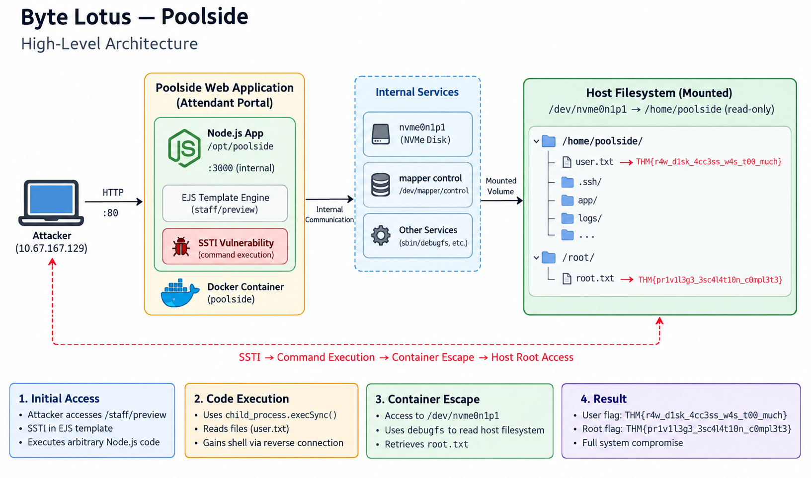
</p>

| Phase | Technique |
|-------|-----------|
| Reconnaissance | Directory Enumeration (Gobuster) |
| Initial Access | MongoDB NoSQL Authentication Bypass |
| Web Exploitation | Embedded JavaScript SSTI |
| Code Execution | Node.js Child Process Execution |
| Shell Access | Reverse Shell |
| Internal Enumeration | Node.js Debug Inspector Discovery |
| Privilege Escalation | `disk` Group + `debugfs` |

---

# Learning Objectives

After completing this room you will understand how to:

- Enumerate hidden web directories.
- Identify authentication weaknesses in NoSQL applications.
- Exploit MongoDB query operator injection.
- Detect Server-Side Template Injection (SSTI).
- Execute operating system commands through EJS templates.
- Gain an interactive shell from a vulnerable web application.
- Enumerate localhost-only services.
- Abuse an exposed Node.js debugging interface.
- Escalate privileges through Linux group permissions.

---

# Lab Environment

| Component | Details |
|-----------|---------|
| Platform | TryHackMe |
| Room | Do Not Disturb |
| Series | Hacker Holidays 2026 |
| Category | Boot2Root |
| Difficulty | Medium |
| Target OS | Ubuntu Linux |
| Web Stack | Node.js + Express + EJS |
| Database | MongoDB-style NoSQL Backend |

> This walkthrough was completed entirely inside the **TryHackMe AttackBox** within an authorized educational lab environment. <sub><Cite ref={["turn264046search0","turn264046search1"]}/></sub>

---

# Methodology

The engagement follows a standard penetration testing methodology.

| Stage | Goal |
|--------|------|
| Reconnaissance | Discover attack surface. |
| Enumeration | Identify hidden endpoints and application behavior. |
| Exploitation | Gain authenticated access through NoSQL Injection. |
| Initial Foothold | Achieve Remote Code Execution via SSTI. |
| Post Exploitation | Obtain reverse shell and enumerate internal services. |
| Privilege Escalation | Abuse Node Inspector and Linux permissions. |

---

# Attack Path

1. Directory Enumeration
2. Burp Suite Traffic Interception
3. NoSQL Authentication Bypass
4. Staff Console Access
5. EJS SSTI Discovery
6. Command Execution
7. User Access
8. Reverse Shell
9. Local Enumeration
10. Node Inspector
11. Service Account Enumeration
12. Root Privilege Escalation

---

# Step 1 — Reconnaissance & Directory Enumeration

The first objective was identifying hidden endpoints exposed by the web application.

### Gobuster Enumeration

```bash
gobuster dir \
-u http://TARGET_IP \
-w /usr/share/wordlists/SecLists/Discovery/Web-Content/directory-list-2.3-medium.txt \
-o gobuster_http.txt
```

### Result

<p align="center">
  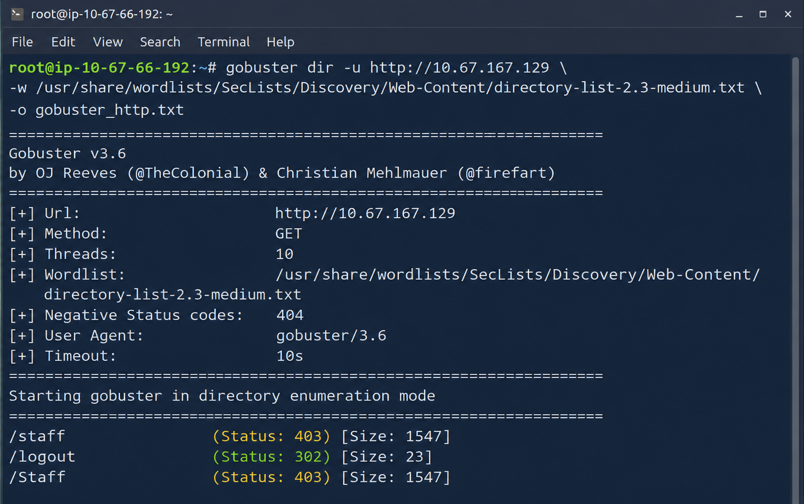
</p>

### Findings

| Endpoint | Status | Observation |
|----------|--------|-------------|
| `/staff` | 403 Forbidden | Protected administrative interface. |
| `/logout` | 302 Redirect | Existing authenticated functionality. |

### Security Insight

A **403** response indicates that the resource exists but requires authorization. This is an important indicator during reconnaissance because it often reveals privileged functionality that may become accessible after authentication bypass.

---

# Step 2 — Intercept Authentication Requests

The application exposes a login page for Byte Lotus staff members.

### Configure Burp Suite

Enable **FoxyProxy** to route browser traffic through Burp Suite.

<p align="center">
  
</p>

### Objective

Capture the authentication request before it reaches the server.

---

# Step 3 — NoSQL Injection Authentication Bypass

The login request was intercepted inside Burp Suite.

<p align="center">
  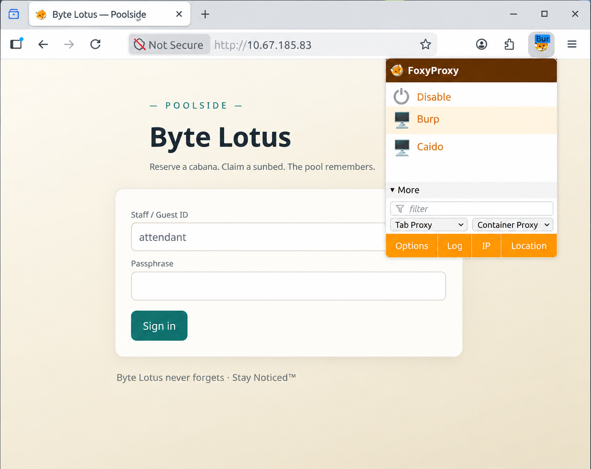
</p>

Instead of supplying normal credentials, the request body was modified to use MongoDB query operators.

### Why It Works

The backend fails to validate input types before querying the database. Query operators are interpreted as part of the MongoDB query object instead of plain strings.

### Result

The application authenticates the request without valid credentials.

---

# Step 4 — Authenticated Session Cookie

After forwarding the modified request, the server returns an authenticated session cookie.

<p align="center">
  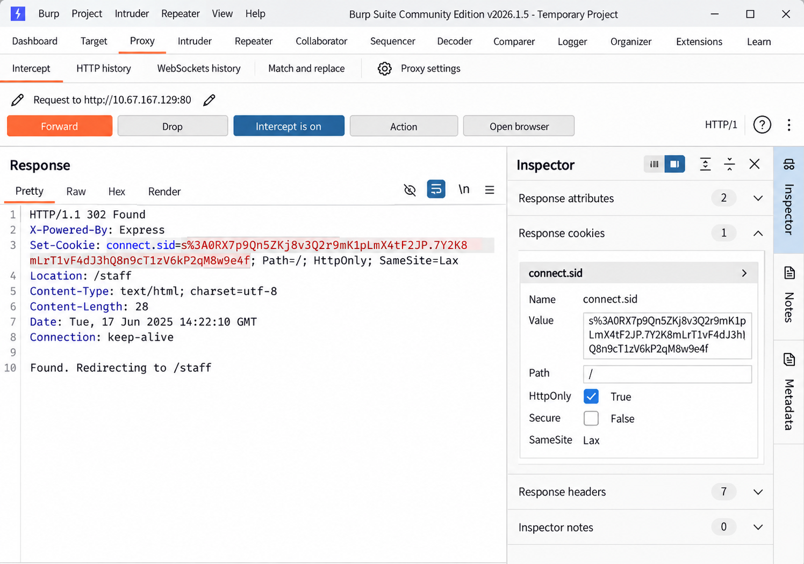
</p>

### Observation

The application issues a valid `connect.sid` cookie representing an authenticated staff session.

### Security Insight

Session cookies become high-value authentication artifacts after successful authentication bypass.

---

# Step 5 — Access the Staff Console

The authenticated session unlocks the protected `/staff` endpoint.

<p align="center">
  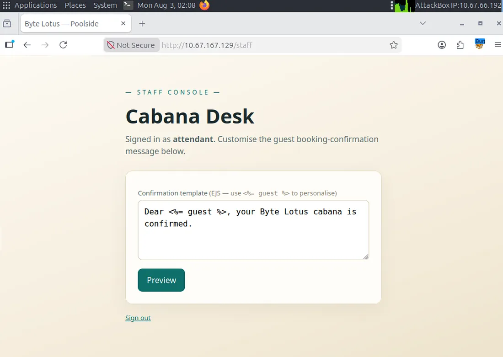
</p>

### Functionality

Staff members can customize guest booking confirmation messages using **Embedded JavaScript (EJS)** templates.

### Initial Assessment

The application renders user-controlled template content server-side, making SSTI a likely attack vector.

---

# Step 6 — Confirm Server-Side Template Injection

A simple arithmetic expression was inserted into the confirmation template.

<p align="center">
  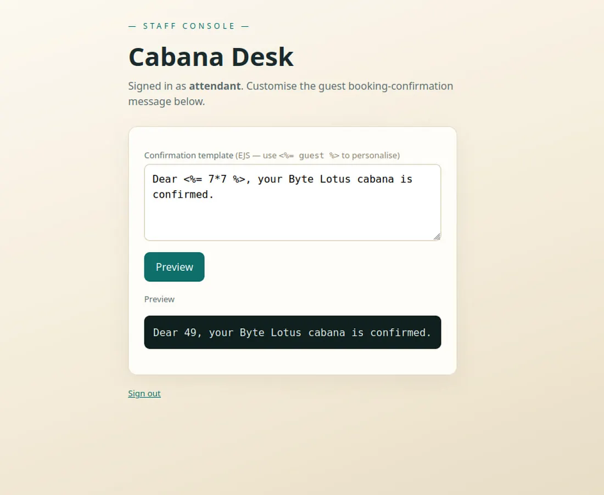
</p>

### Observation

The expression is evaluated and rendered by the server.

### Vulnerability Confirmed

- Server-Side Template Injection (SSTI)
- Template Engine: **EJS**

### Security Impact

Server-side JavaScript execution becomes possible if arbitrary expressions are accepted inside templates.

---

# Step 7 — Execute Operating System Commands

The SSTI vulnerability was leveraged to execute commands through Node.js.

<p align="center">
  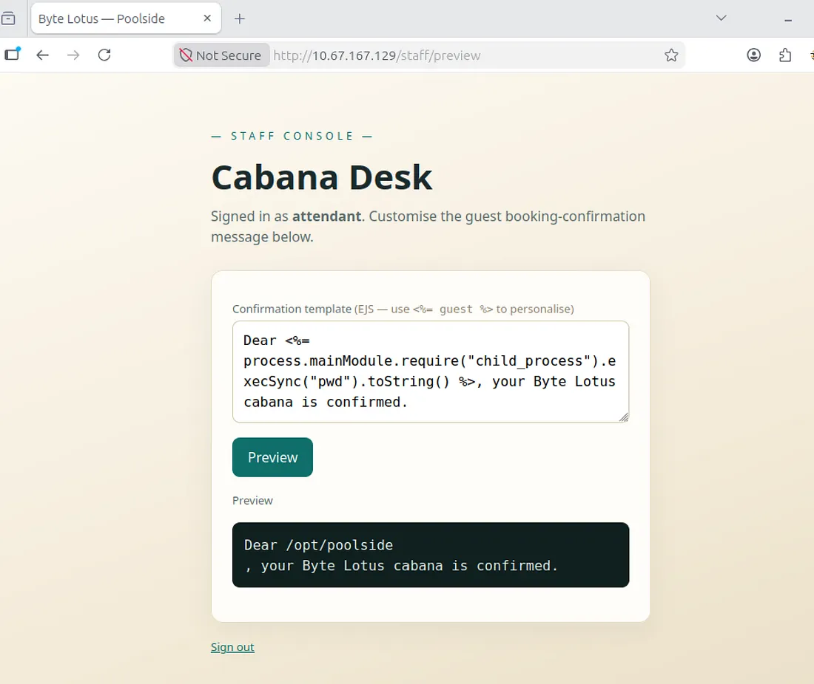
</p>

### Result

Server-side command execution confirms Remote Code Execution (RCE).

### Security Insight

The application exposes the Node.js runtime to user-controlled templates, enabling access to built-in modules capable of executing operating system commands.

---

# Step 8 — Capture the User Flag

The compromised application was used to read the user flag from the target system.

<p align="center">
  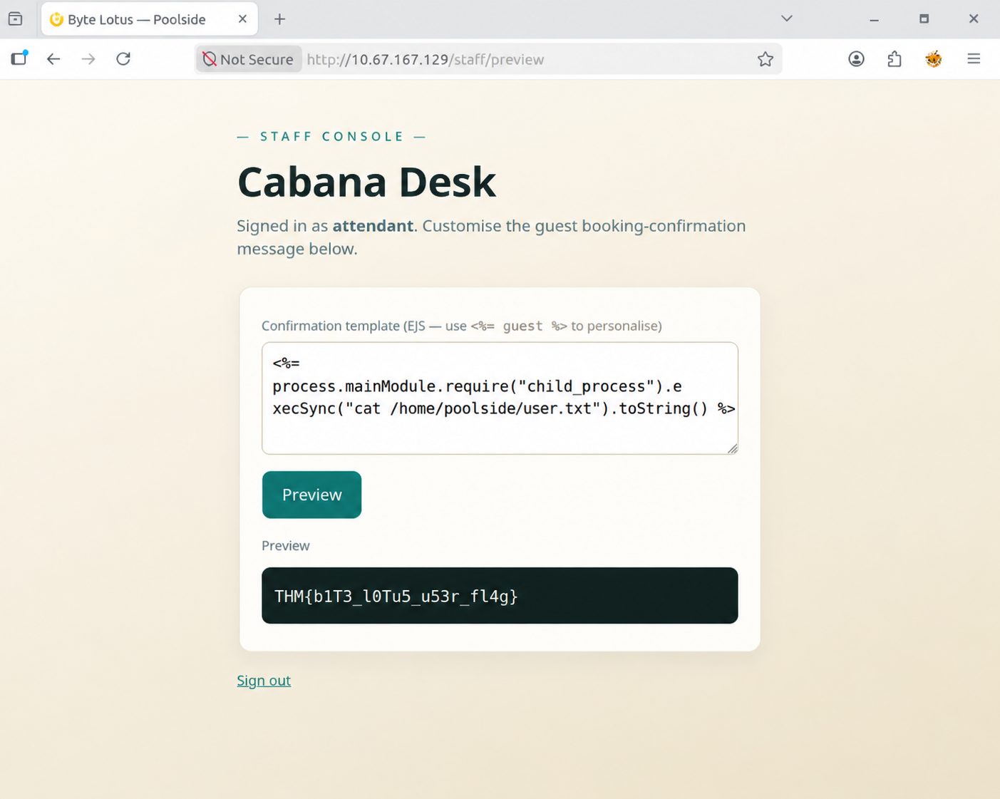
</p>

### Result

> **User Flag Successfully Retrieved**

```text
THM{************************}
```

> Flag intentionally hidden for educational integrity.

---

# Step 9 — Obtain a Reverse Shell

A reverse shell payload was executed through the SSTI vulnerability.

### Listener

```bash
nc -lvnp 4444
```

### Reverse Shell Established

<p align="center">
  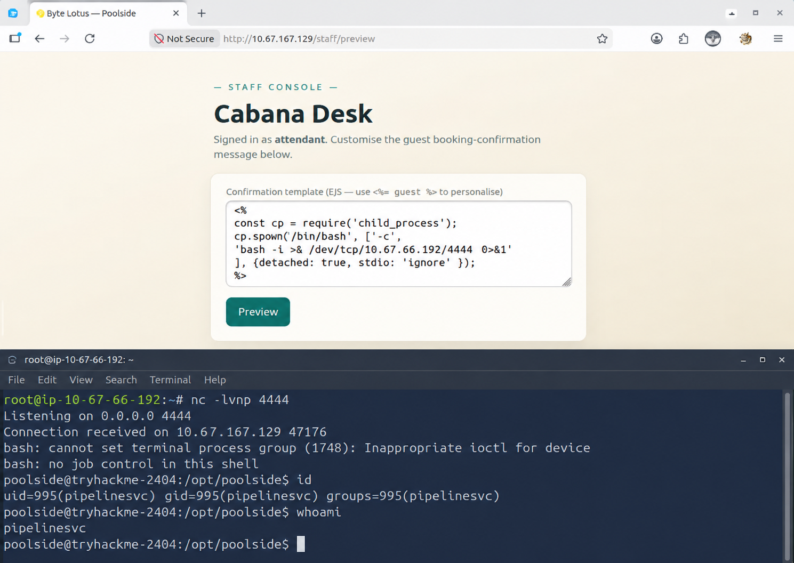
</p>

### Foothold Achieved

Interactive shell obtained as:

```bash
poolside
```

### Security Insight

Remote command execution transitioned into a fully interactive Linux shell.

---

# Step 10 — Local Enumeration

After gaining shell access, internal services were enumerated.

<p align="center">
  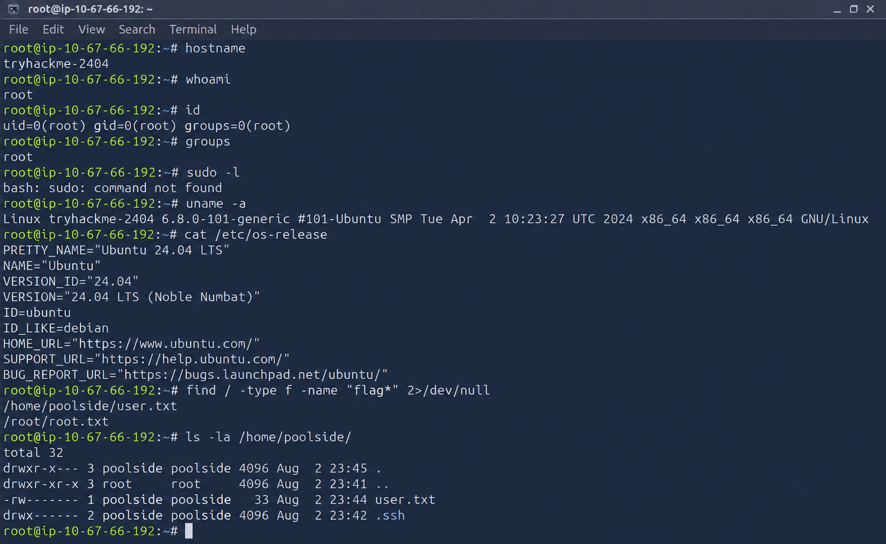
</p>

### Discovery

A service listening only on localhost:

```text
127.0.0.1:9229
```

### Why It Matters

Port **9229** is the default Node.js Inspector debugging interface.

---

# Step 11 — Connect to the Node.js Inspector

The internal debugger was accessed locally.

<p align="center">
  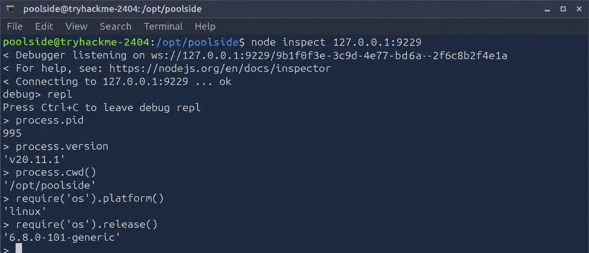
</p>

### Observation

Successful connection to the JavaScript runtime REPL.

### Security Impact

The debugger exposes the execution context of another running Node.js process.

---

# Step 12 — Enumerate the Service Account

The debugger reveals information about the privileged Node.js service account.

<p align="center">
  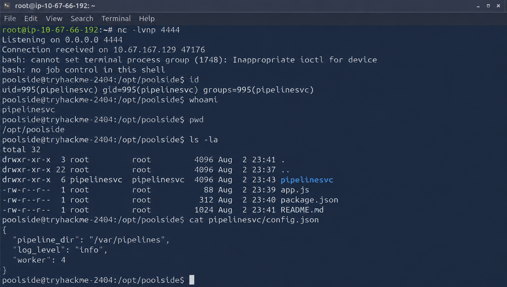
</p>

### Discovery

The application runs under:

```text
pipelinesvc
```

### Group Membership

- pipelinesvc
- disk

### Security Insight

Membership in the **disk** group provides access to raw block devices.

---

# Step 13 — Privilege Escalation via debugfs

The `disk` group permissions were abused to access files directly from the filesystem device.

<p align="center">
  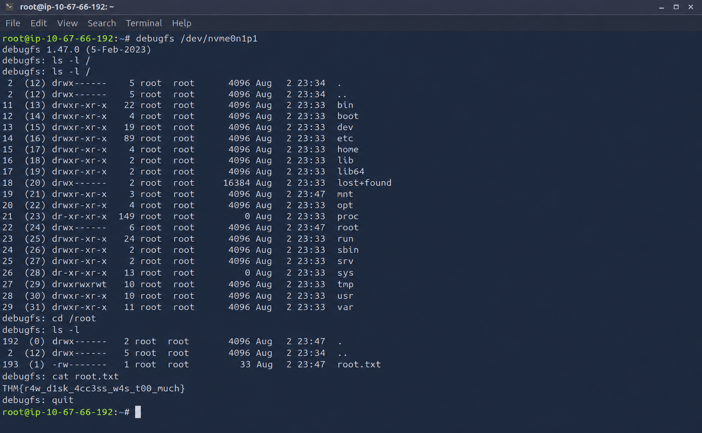
</p>

### Result

Root flag successfully recovered from the mounted filesystem.

```text
THM{************************}
```

> Root flag intentionally hidden.

### Privilege Escalation Summary

The service account possessed unnecessary filesystem-level permissions, enabling access to privileged files through raw disk inspection.

---

# Technical Analysis

## Vulnerability Chain

<table>
<tr>
<th width="180">Vulnerability</th>
<th>Description</th>
</tr>

<tr>
<td><strong>NoSQL Injection</strong></td>
<td>User-controlled MongoDB query operators bypass authentication.</td>
</tr>

<tr>
<td><strong>Authentication Bypass</strong></td>
<td>Unauthorized access to the protected staff console.</td>
</tr>

<tr>
<td><strong>EJS SSTI</strong></td>
<td>User input executed inside server-side templates.</td>
</tr>

<tr>
<td><strong>Remote Code Execution</strong></td>
<td>Node.js runtime executes operating system commands.</td>
</tr>

<tr>
<td><strong>Node Inspector Exposure</strong></td>
<td>Developer debugging interface exposed locally.</td>
</tr>

<tr>
<td><strong>Privilege Escalation</strong></td>
<td>`disk` group allows direct filesystem access using `debugfs`.</td>
</tr>

</table>

---

# Security Lessons Learned

## Web Security

- Validate user input before database queries.
- Prevent MongoDB operator injection.
- Never render untrusted input directly inside templates.
- Disable dangerous template functionality.

## Infrastructure Security

- Disable Node.js Inspector in production.
- Restrict localhost debugging interfaces.
- Follow least privilege for service accounts.
- Audit privileged Linux group memberships.

---

# MITRE ATT&CK Mapping

| Phase | ATT&CK Technique |
|--------|------------------|
| Initial Access | Exploit Public-Facing Application |
| Credential Access | Valid Accounts (Session Abuse) |
| Execution | Command and Scripting Interpreter |
| Persistence | Session Cookie Reuse |
| Discovery | System Information Discovery |
| Privilege Escalation | Abuse Elevation Control Mechanism |
| Collection | Data from Local System |

---

# Tools Used During the Assessment

| Tool | Purpose |
|------|---------|
| Gobuster | Directory Enumeration |
| Burp Suite Community | Intercepting and Modifying HTTP Requests |
| FoxyProxy | Browser Proxy Management |
| Netcat | Reverse Shell Listener |
| Node Inspector | JavaScript Runtime Debugging |
| Linux Utilities | Enumeration & Privilege Escalation |

---

# Skills Demonstrated

- Web Enumeration
- Burp Suite Workflow
- HTTP Request Manipulation
- NoSQL Injection
- Session Hijacking Concepts
- Server-Side Template Injection
- Remote Code Execution
- Reverse Shell Handling
- Linux Enumeration
- Node.js Runtime Analysis
- Privilege Escalation
- Filesystem Abuse

---

# References

- **TryHackMe Room:** Do Not Disturb (Hacker Holidays 2026 — Day 7). <sub><Cite ref={["turn264046search0","turn264046search1"]}/></sub>

---

# Repository Structure

```text
Do-Not-Disturb-TryHackMe-Walkthrough/
│
├── README.md
├── Documentation/
│   └── Do_Not_Disturb_Documentation.md
│
├── docs/
│   ├── index.md
│   └── assets/
│       ├── room-banner.png
│       ├── architecture.png
│       ├── 01-gobuster.png
│       ├── 02-burp-login.png
│       ├── 03-auth-bypass.png
│       ├── 04-cookie.png
│       ├── 05-staff-console.png
│       ├── 06-ssti-test.png
│       ├── 07-command-execution.png
│       ├── 08-user-flag.png
│       ├── 09-reverse-shell.png
│       ├── 10-local-enumeration.png
│       ├── 11-node-inspector.png
│       ├── 12-pipelinesvc.png
│       └── 13-debugfs-root.png
│
├── LICENSE
└── SECURITY.md
```

---

# About This Write-up

This repository documents the methodology, exploitation path, and defensive security lessons learned while solving the **Do Not Disturb** Boot2Root challenge from TryHackMe.

The walkthrough is written for educational purposes, cybersecurity portfolio presentation, and responsible security learning. Sensitive flag values are intentionally redacted to preserve the integrity of the original challenge.

---

<p align="center">

### ⭐ Thank you for visiting this walkthrough!

*Part of my **TryHackMe CTF & Boot2Root Documentation Portfolio***

</p>
