<div class="ctf-hero">

  <h1>Do Not Disturb</h1>

  <p>
    A technical penetration testing walkthrough for the
    <strong>Do Not Disturb</strong> room from TryHackMe's
    <strong>Hacker Holidays 2026</strong> series. The documented attack
    chain progresses from web enumeration and NoSQL authentication bypass
    through EJS Server-Side Template Injection, Node.js command execution,
    reverse shell access, Node.js Inspector abuse, and Linux privilege
    escalation through the <code>disk</code> group.
  </p>

  <div class="ctf-badges">
    <span class="ctf-badge">TryHackMe</span>
    <span class="ctf-badge">Hacker Holidays 2026</span>
    <span class="ctf-badge">Medium</span>
    <span class="ctf-badge">Boot2Root</span>
    <span class="ctf-badge">Linux</span>
    <span class="ctf-badge">Web Security</span>
  </div>

</div>

<p align="center">
  
</p>

---

## Quick Overview

<div class="ctf-card-grid">

  <div class="ctf-card">
    <div class="ctf-card-title">Platform</div>
    <div class="ctf-card-value">TryHackMe</div>
  </div>

  <div class="ctf-card">
    <div class="ctf-card-title">Series</div>
    <div class="ctf-card-value">Hacker Holidays 2026</div>
  </div>

  <div class="ctf-card">
    <div class="ctf-card-title">Room</div>
    <div class="ctf-card-value">Do Not Disturb</div>
  </div>

  <div class="ctf-card">
    <div class="ctf-card-title">Difficulty</div>
    <div class="ctf-card-value">Medium</div>
  </div>

  <div class="ctf-card">
    <div class="ctf-card-title">Category</div>
    <div class="ctf-card-value">Boot2Root</div>
  </div>

  <div class="ctf-card">
    <div class="ctf-card-title">Target OS</div>
    <div class="ctf-card-value">Ubuntu Linux</div>
  </div>

  <div class="ctf-card">
    <div class="ctf-card-title">Web Stack</div>
    <div class="ctf-card-value">Node.js + Express + EJS</div>
  </div>

  <div class="ctf-card">
    <div class="ctf-card-title">Database</div>
    <div class="ctf-card-value">MongoDB-style NoSQL Backend</div>
  </div>

</div>

---

## Navigation

<div class="ctf-toc">

<div class="ctf-toc-title">Documentation Map</div>

- [Mission](#mission)
- [Quick Overview](#quick-overview)
- [Attack Chain](#attack-chain)
- [Learning Objectives](#learning-objectives)
- [Lab Environment](#lab-environment)
- [Methodology](#methodology)
- [Reconnaissance and Directory Enumeration](#reconnaissance-and-directory-enumeration)
- [Authentication Request Analysis](#authentication-request-analysis)
- [NoSQL Injection Authentication Bypass](#nosql-injection-authentication-bypass)
- [Authenticated Session](#authenticated-session)
- [Staff Console](#staff-console)
- [EJS Server-Side Template Injection](#ejs-server-side-template-injection)
- [Remote Code Execution](#remote-code-execution)
- [User Flag](#user-flag)
- [Reverse Shell](#reverse-shell)
- [Local Enumeration](#local-enumeration)
- [Node.js Inspector](#nodejs-inspector)
- [Service Account Enumeration](#service-account-enumeration)
- [Privilege Escalation via `disk` Group](#privilege-escalation-via-disk-group)
- [Technical Findings](#technical-findings)
- [MITRE ATT&CK Mapping](#mitre-attck-mapping)
- [Tools Used](#tools-used)
- [Key Findings](#key-findings)
- [Security Recommendations](#security-recommendations)
- [Skills Demonstrated](#skills-demonstrated)
- [Lessons Learned](#lessons-learned)
- [References](#references)
- [Repository Structure](#repository-structure)
- [Responsible Use](#responsible-use)
- [About This Write-up](#about-this-write-up)

</div>

---

## Mission

The objective of **Do Not Disturb** is to compromise a Node.js web application and progress through multiple security weaknesses until privileged filesystem access is obtained.

The challenge demonstrates the importance of chaining vulnerabilities rather than treating each finding in isolation.

The documented path is:

<div class="attack-chain">

  <div class="attack-step">Web Enumeration</div>

  <div class="attack-arrow">→</div>

  <div class="attack-step">NoSQL Injection</div>

  <div class="attack-arrow">→</div>

  <div class="attack-step">Authentication Bypass</div>

  <div class="attack-arrow">→</div>

  <div class="attack-step">EJS SSTI</div>

  <div class="attack-arrow">→</div>

  <div class="attack-step">RCE</div>

  <div class="attack-arrow">→</div>

  <div class="attack-step">Reverse Shell</div>

  <div class="attack-arrow">→</div>

  <div class="attack-step">Node Inspector</div>

  <div class="attack-arrow">→</div>

  <div class="attack-step">`disk` Group</div>

  <div class="attack-arrow">→</div>

  <div class="attack-step">Root Access</div>

</div>

---

## Attack Chain

<p align="center">
  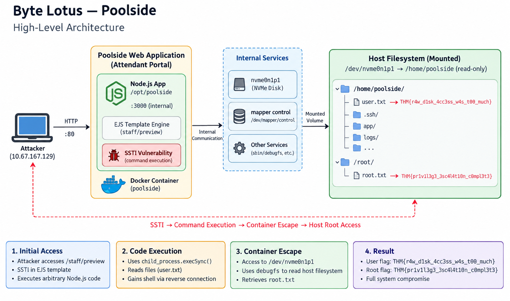
</p>

| Phase | Technique | Outcome |
|---|---|---|
| Reconnaissance | Directory Enumeration with Gobuster | Discovered protected `/staff` functionality |
| Initial Access | MongoDB NoSQL authentication bypass | Obtained authenticated staff access |
| Web Exploitation | EJS Server-Side Template Injection | Confirmed server-side expression evaluation |
| Code Execution | Node.js command execution | Achieved remote command execution |
| Shell Access | Reverse shell | Obtained an interactive `poolside` shell |
| Internal Enumeration | Local service discovery | Identified `127.0.0.1:9229` |
| Runtime Analysis | Node.js Inspector | Accessed the JavaScript runtime debugging interface |
| Privilege Escalation | `disk` group + `debugfs` | Accessed privileged filesystem data |

---

## Learning Objectives

This room demonstrates the following practical security concepts:

- Web directory enumeration.
- Identification of protected application functionality.
- HTTP request interception and modification.
- MongoDB query operator injection.
- NoSQL authentication bypass.
- Session handling after authentication bypass.
- Server-Side Template Injection.
- EJS template analysis.
- Node.js command execution.
- Remote Code Execution.
- Reverse shell handling.
- Localhost-only service discovery.
- Node.js Inspector exposure.
- Linux service-account analysis.
- Linux group-based privilege escalation.
- Raw filesystem access through `debugfs`.

---

## Lab Environment

| Component | Details |
|---|---|
| Platform | TryHackMe |
| Room | Do Not Disturb |
| Series | Hacker Holidays 2026 |
| Category | Boot2Root |
| Difficulty | Medium |
| Target OS | Ubuntu Linux |
| Web Stack | Node.js + Express + EJS |
| Database | MongoDB-style NoSQL Backend |
| Lab Environment | TryHackMe AttackBox |

> This walkthrough was completed inside the authorized TryHackMe AttackBox environment as part of an educational cybersecurity lab.

---

## Methodology

The engagement follows a practical penetration testing workflow:

| Stage | Objective |
|---|---|
| Reconnaissance | Identify exposed application functionality |
| Enumeration | Discover endpoints and understand application behavior |
| Authentication Testing | Test the staff authentication mechanism |
| Exploitation | Bypass authentication through NoSQL injection |
| Initial Foothold | Exploit EJS SSTI to obtain command execution |
| Post-Exploitation | Establish a reverse shell and enumerate the host |
| Internal Service Analysis | Identify the localhost Node.js Inspector |
| Privilege Escalation | Abuse `disk` group filesystem access |
| Objective Completion | Recover privileged filesystem data |

---

# Reconnaissance and Directory Enumeration

The initial objective was to identify hidden web resources exposed by the target application.

## Gobuster Enumeration

The following Gobuster command was used for directory discovery:

```bash
gobuster dir \
-u http://TARGET_IP \
-w /usr/share/wordlists/SecLists/Discovery/Web-Content/directory-list-2.3-medium.txt \
-o gobuster_http.txt
```

### What the Command Does

Gobuster performs directory enumeration against the target web server using the supplied wordlist.

The scan was used to identify application paths that were not immediately visible through normal browsing.

<div class="command-result">

  <div class="command-result-header">
    Command — Web Directory Enumeration
  </div>

  <pre><code>gobuster dir \
-u http://TARGET_IP \
-w /usr/share/wordlists/SecLists/Discovery/Web-Content/directory-list-2.3-medium.txt \
-o gobuster_http.txt</code></pre>

</div>

## Enumeration Evidence

<figure>

  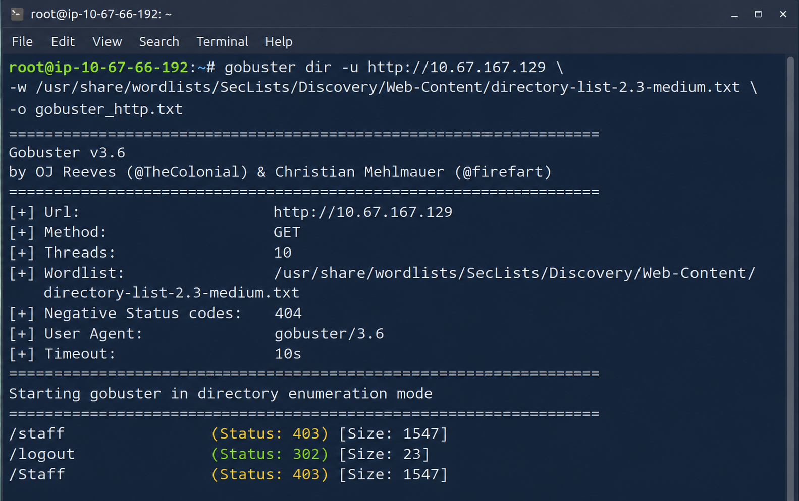

  <figcaption>
    Figure — Gobuster enumeration identifying protected and application-related endpoints.
  </figcaption>

</figure>

## Discovered Endpoints

| Endpoint | Status | Observation |
|---|---:|---|
| `/staff` | 403 Forbidden | Protected administrative interface |
| `/logout` | 302 Redirect | Existing authenticated application functionality |

### Security Insight

A `403 Forbidden` response is useful during reconnaissance because it indicates that the requested resource exists but access is currently restricted.

The `/staff` endpoint therefore represented an interesting administrative attack surface even though direct unauthenticated access was denied.

---

# Authentication Request Analysis

The application exposes a login interface intended for Byte Lotus staff members.

The authentication request was intercepted before being sent to the server so that its structure and parameters could be examined.

## Burp Suite Workflow

Browser traffic was routed through Burp Suite using FoxyProxy.

<figure>

  

  <figcaption>
    Figure — Authentication traffic intercepted through the Burp Suite workflow.
  </figcaption>

</figure>

### Objective

The objective at this stage was to:

1. Capture the normal authentication request.
2. Inspect the request structure.
3. Determine how the backend processes supplied credentials.
4. Test whether the application's database query could be manipulated.

---

# NoSQL Injection Authentication Bypass

The intercepted authentication request was modified to test the application's handling of MongoDB-style query operators.

<figure>

  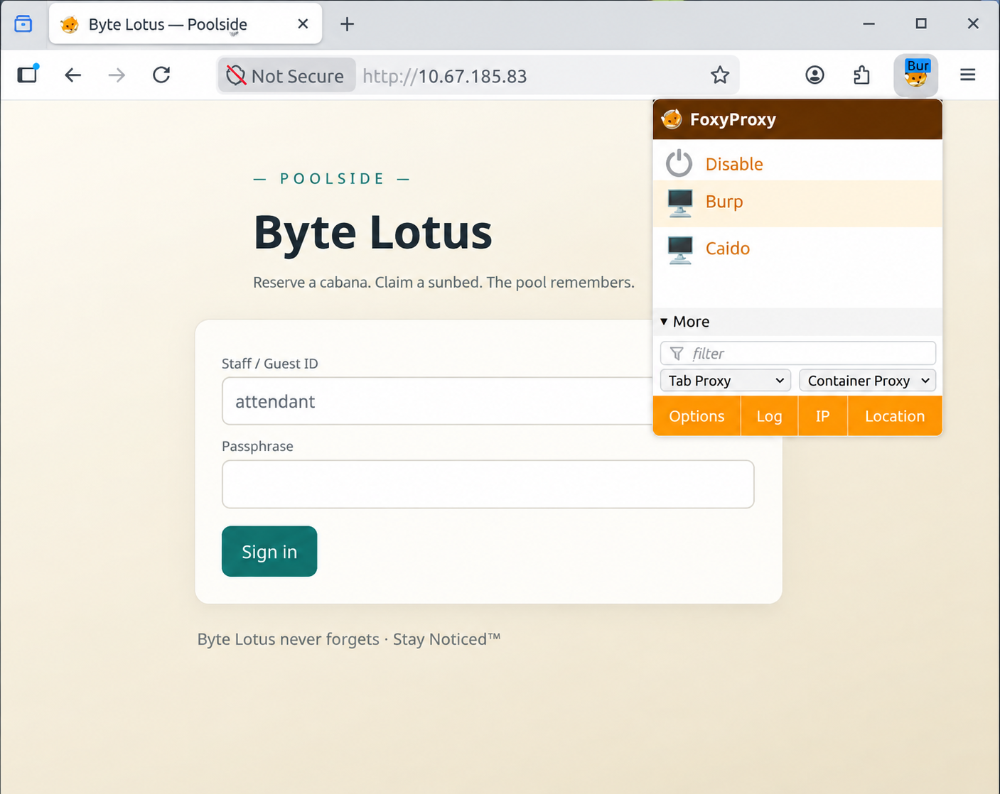

  <figcaption>
    Figure — Authentication request modified to test NoSQL query operator injection.
  </figcaption>

</figure>

## Why the Bypass Works

The application does not adequately constrain the types of values supplied to the authentication query.

Instead of treating supplied credentials strictly as ordinary strings, MongoDB query operators can be interpreted as part of the database query structure.

This allows the authentication logic to be manipulated without providing a legitimate password.

## Result

The modified authentication request was accepted by the application, providing authenticated access without valid credentials.

<div class="key-finding">

  <div class="key-finding-title">
    Key Finding — NoSQL Authentication Bypass
  </div>

  The authentication mechanism accepts attacker-controlled MongoDB query operators instead of enforcing strict input types, allowing authentication to be bypassed.
  
</div>

---

# Authenticated Session

After the authentication bypass succeeded, the application returned an authenticated session cookie.

<figure>

  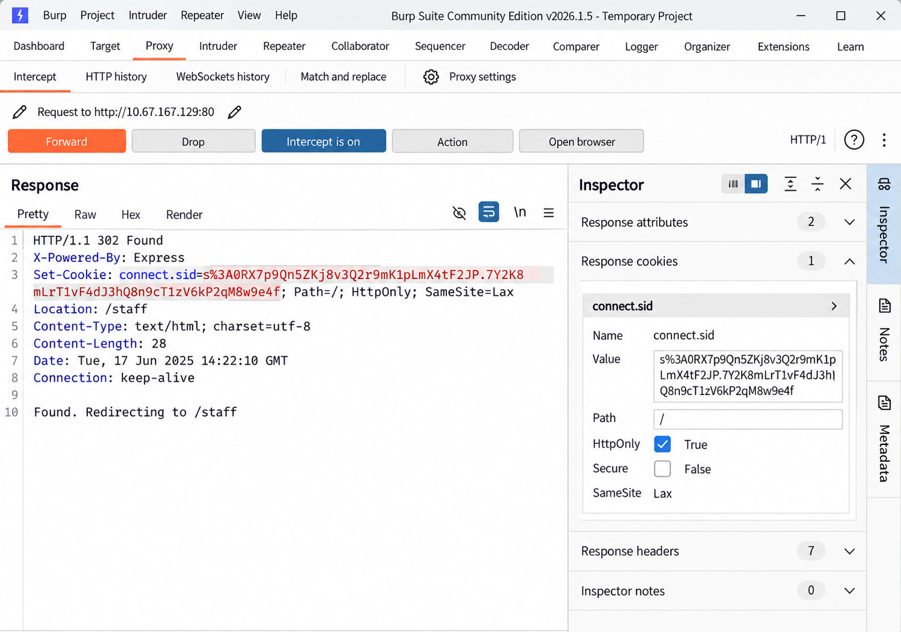

  <figcaption>
    Figure — Authenticated session represented by the documented <code>connect.sid</code> cookie.
  </figcaption>

</figure>

## Session Artifact

The application issued:

```text
connect.sid
```

The cookie represented the authenticated staff session obtained after exploiting the login mechanism.

### Security Significance

Once authentication has been bypassed, the resulting session becomes an important authentication artifact because it can be used to access functionality that is otherwise protected.

---

# Staff Console

The authenticated session was used to access the previously protected `/staff` endpoint.

<figure>

  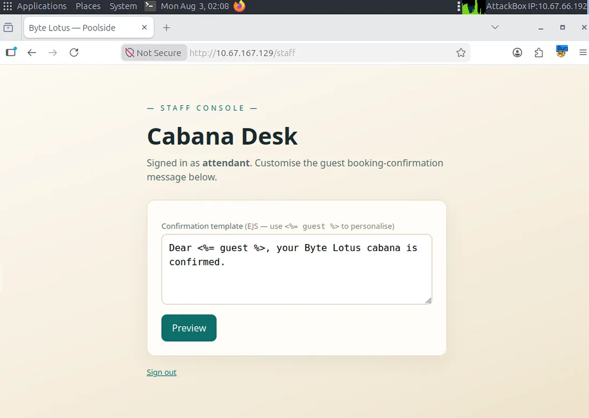

  <figcaption>
    Figure — Staff console accessible after the authentication bypass.
  </figcaption>

</figure>

## Application Functionality

The staff interface provides functionality for customizing guest booking confirmation messages.

The messages are processed using **Embedded JavaScript (EJS)** templates.

This server-side rendering behavior created a new attack surface because user-controlled template content was being processed by the server.

---

# EJS Server-Side Template Injection

The next stage was determining whether the confirmation message field interpreted supplied input as an EJS template rather than rendering it as ordinary text.

## SSTI Validation

A simple arithmetic expression was inserted into the confirmation template.

<figure>

  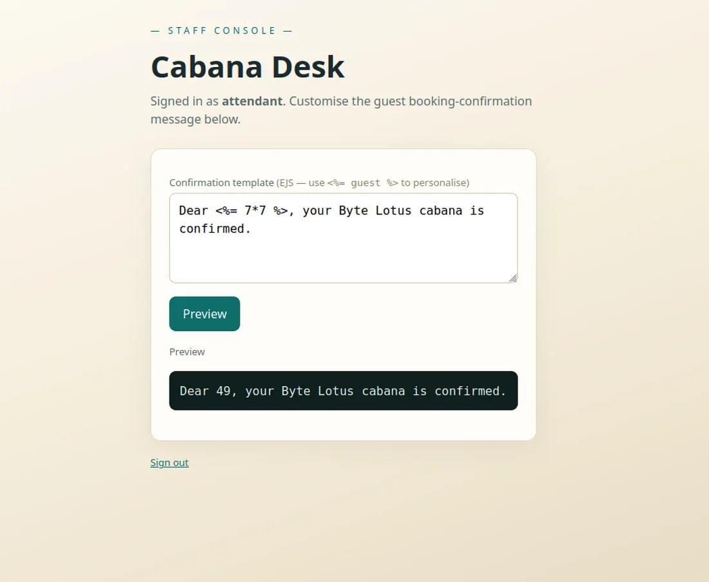

  <figcaption>
    Figure — Server-side evaluation of an EJS expression confirms template injection.
  </figcaption>

</figure>

## Vulnerability Confirmation

The expression was evaluated and rendered by the server.

This confirmed:

- Server-Side Template Injection.
- EJS as the affected template engine.
- Server-side evaluation of attacker-controlled template expressions.

<div class="key-finding">

  <div class="key-finding-title">
    Key Finding — EJS SSTI
  </div>

  User-controlled content is evaluated inside server-side EJS templates. This moves the issue beyond ordinary input reflection and exposes the server-side JavaScript execution context.
  
</div>

## Security Impact

Because the vulnerable template executes within the Node.js application runtime, template injection can provide access to server-side functionality that should never be exposed to untrusted input.

---

# Remote Code Execution

The confirmed EJS SSTI was subsequently leveraged to execute operating-system commands through the Node.js runtime.

<figure>

  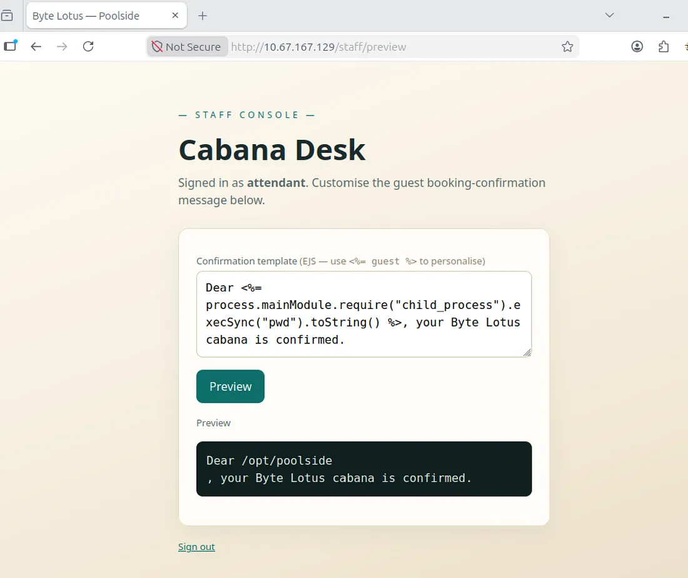

  <figcaption>
    Figure — Server-side operating-system command execution achieved through the vulnerable template.
  </figcaption>

</figure>

## Result

Server-side command execution confirmed **Remote Code Execution (RCE)** against the application.

<div class="attack-chain">

  <div class="attack-step">EJS SSTI</div>

  <div class="attack-arrow">→</div>

  <div class="attack-step">Node.js Runtime</div>

  <div class="attack-arrow">→</div>

  <div class="attack-step">OS Command Execution</div>

  <div class="attack-arrow">→</div>

  <div class="attack-step">RCE</div>

</div>

### Security Insight

The vulnerable application exposes the Node.js execution environment to attacker-controlled template expressions.

This allows functionality capable of executing operating-system commands to be reached from the web application.

---

# User Flag

The compromised application was used to retrieve the documented user flag.

<figure>

  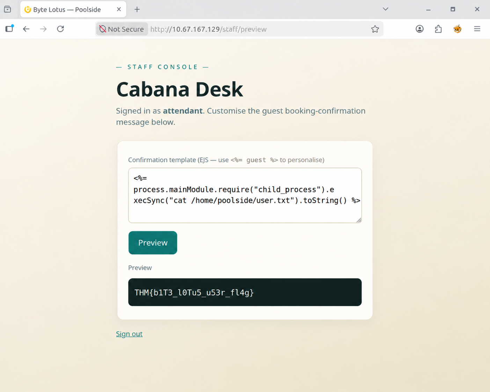

  <figcaption>
    Figure — Evidence of successful user-level objective completion.
  </figcaption>

</figure>

## Result

The user flag was successfully retrieved.

```text
THM{************************}
```

> Flag intentionally hidden for educational integrity.

---

# Reverse Shell

After achieving remote command execution, the next objective was to transition from individual command execution to an interactive shell.

## Listener

A Netcat listener was prepared on the attack machine:

```bash
nc -lvnp 4444
```

## Reverse Shell Established

<figure>

  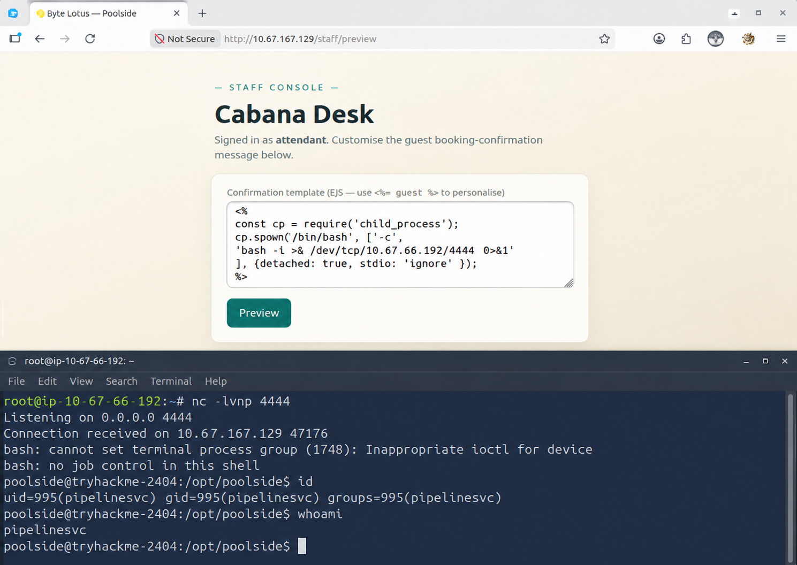

  <figcaption>
    Figure — Interactive reverse shell established following web application compromise.
  </figcaption>

</figure>

## Foothold

The resulting shell was obtained as:

```bash
poolside
```

<div class="key-finding">

  <div class="key-finding-title">
    Key Finding — Initial Host Access
  </div>

  The web-layer RCE was successfully converted into an interactive Linux shell running as the documented <code>poolside</code> user.
  
</div>

---

# Local Enumeration

With an interactive shell established, the assessment moved from application exploitation to host-level enumeration.

<figure>

  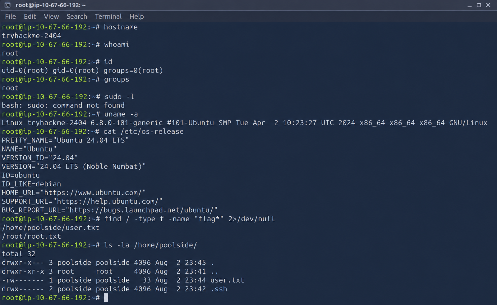

  <figcaption>
    Figure — Local enumeration identifying a service listening on the loopback interface.
  </figcaption>

</figure>

## Local Service Discovery

A service was identified on:

```text
127.0.0.1:9229
```

## Why Port 9229 Matters

Port `9229` is the default port commonly associated with the **Node.js Inspector** debugging interface.

Because the service was bound to `127.0.0.1`, it was not directly exposed through the external network interface.

However, after obtaining local shell access, the service became reachable from the compromised host.

<div class="key-finding">

  <div class="key-finding-title">
    Key Finding — Internal Debug Interface
  </div>

  A Node.js Inspector service was accessible on <code>127.0.0.1:9229</code> from the compromised host, exposing an additional internal attack surface.
  
</div>

---

# Node.js Inspector

The locally accessible Node.js debugging interface was investigated after its discovery during post-exploitation enumeration.

<figure>

  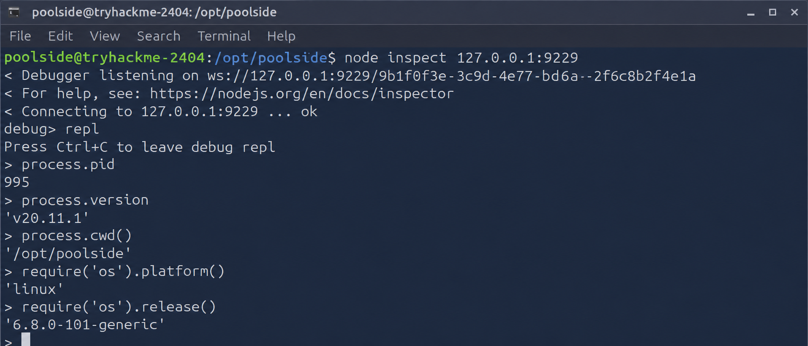

  <figcaption>
    Figure — Access to the Node.js Inspector runtime debugging interface.
  </figcaption>

</figure>

## Observation

The debugger provided access to the JavaScript runtime environment.

This exposed execution context associated with another Node.js process running on the target.

## Security Impact

A debugging interface intended for development or troubleshooting can expose powerful runtime capabilities when accessible to an attacker.

In this challenge, the Node.js Inspector became an important pivot point for discovering information about the privileged service account.

---

# Service Account Enumeration

Further analysis of the Node.js runtime revealed information about the service account associated with the privileged process.

<figure>

  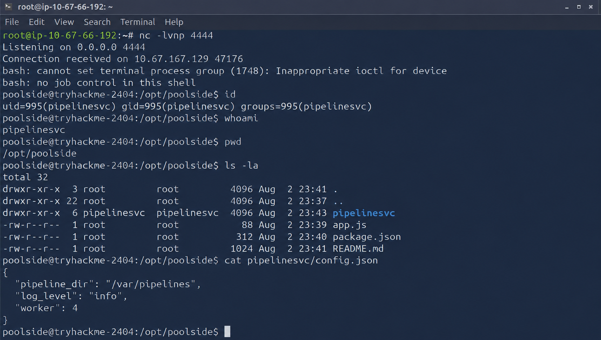

  <figcaption>
    Figure — Enumeration of the <code>pipelinesvc</code> service account and its group membership.
  </figcaption>

</figure>

## Account Discovery

The identified service account was:

```text
pipelinesvc
```

## Group Membership

The documented memberships included:

```text
pipelinesvc
disk
```

### Security Significance

Membership in the Linux `disk` group can provide access to raw block devices.

This is significantly more privileged than the permissions normally required by a service account.

<div class="key-finding">

  <div class="key-finding-title">
    Key Finding — Excessive Filesystem Privileges
  </div>

  The documented <code>pipelinesvc</code> service account belongs to the <code>disk</code> group, providing raw-device access that can be abused to inspect filesystem data outside normal file-level permissions.
  
</div>

---

# Privilege Escalation via `disk` Group

The discovered `disk` group membership provided the final privilege-escalation path.

The raw filesystem access was used with `debugfs` to inspect the filesystem directly.

<figure>

  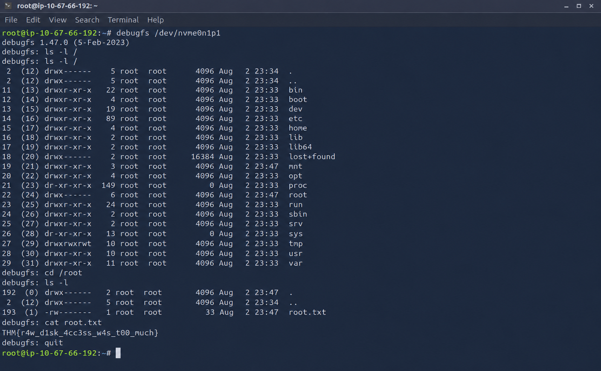

  <figcaption>
    Figure — Privileged filesystem access through <code>debugfs</code> leading to the root objective.
  </figcaption>

</figure>

## Privilege Escalation Chain

<div class="attack-chain">

  <div class="attack-step">Reverse Shell</div>

  <div class="attack-arrow">→</div>

  <div class="attack-step">Local Enumeration</div>

  <div class="attack-arrow">→</div>

  <div class="attack-step">Node Inspector</div>

  <div class="attack-arrow">→</div>

  <div class="attack-step">pipelinesvc</div>

  <div class="attack-arrow">→</div>

  <div class="attack-step">disk Group</div>

  <div class="attack-arrow">→</div>

  <div class="attack-step">debugfs</div>

  <div class="attack-arrow">→</div>

  <div class="attack-step">Root Filesystem Data</div>

</div>

## Result

The root flag was successfully recovered from the filesystem.

```text
THM{************************}
```

> Root flag intentionally hidden.

### Privilege Escalation Summary

The escalation was based on excessive filesystem-level privileges assigned to the service account.

Rather than relying on a conventional `sudo` configuration or setuid binary, the documented path abused raw disk access provided through Linux group membership.

---

# Technical Findings

The documented compromise consisted of multiple weaknesses that could be chained together.

| Finding | Description | Documented Impact |
|---|---|---|
| NoSQL Injection | User-controlled MongoDB query operators were accepted by the authentication mechanism. | Authentication bypass |
| Authentication Bypass | The login mechanism could be bypassed without valid credentials. | Access to `/staff` |
| EJS SSTI | User-controlled content was evaluated as EJS server-side template code. | Server-side code execution |
| Remote Code Execution | Node.js functionality was leveraged to execute operating-system commands. | Host-level command execution |
| Node.js Inspector Exposure | A local Node.js debugging interface was available on `127.0.0.1:9229`. | Runtime inspection and additional access |
| Excessive `disk` Group Membership | `pipelinesvc` had raw disk access through the `disk` group. | Direct filesystem inspection |
| Privilege Escalation | `debugfs` was used against the filesystem through the available raw-device privileges. | Root filesystem data access |

---

# Tools Used

<div class="tool-list">

  <span class="tool-tag">Gobuster</span>
  <span class="tool-tag">Burp Suite Community</span>
  <span class="tool-tag">FoxyProxy</span>
  <span class="tool-tag">Netcat</span>
  <span class="tool-tag">Node.js Inspector</span>
  <span class="tool-tag">Linux Utilities</span>
  <span class="tool-tag">debugfs</span>

</div>

| Tool | Purpose |
|---|---|
| Gobuster | Web directory enumeration |
| Burp Suite Community | Intercepting and modifying HTTP requests |
| FoxyProxy | Browser proxy management |
| Netcat | Reverse shell listener |
| Node.js Inspector | JavaScript runtime debugging and analysis |
| Linux Utilities | Host enumeration and privilege-escalation analysis |
| `debugfs` | Filesystem-level inspection during privilege escalation |

---

# MITRE ATT&CK Mapping

The original documentation identified the following ATT&CK-aligned activity.

| Phase | ATT&CK Technique | Documented Activity |
|---|---|---|
| Initial Access | Exploit Public-Facing Application | Exploitation of the exposed web application |
| Credential Access | Valid Accounts (Session Abuse) | Use of the authenticated session obtained after bypass |
| Execution | Command and Scripting Interpreter | Server-side Node.js command execution |
| Persistence | Session Cookie Reuse | Authenticated session represented by `connect.sid` |
| Discovery | System Information Discovery | Local host and service enumeration |
| Privilege Escalation | Abuse Elevation Control Mechanism | Abuse of privileged Linux group membership |
| Collection | Data from Local System | Retrieval of filesystem-resident challenge data |

> These mappings reflect the ATT&CK categorization documented in the original walkthrough. They are included as contextual mappings rather than as additional findings.

---

# Key Findings

<div class="key-finding">

  <div class="key-finding-title">
    01 — NoSQL Authentication Bypass
  </div>

  The authentication layer failed to constrain attacker-controlled query input, allowing MongoDB-style operators to influence the authentication query and bypass normal credential validation.

</div>

<div class="key-finding">

  <div class="key-finding-title">
    02 — Server-Side Template Injection
  </div>

  The staff console rendered user-controlled content through EJS. Template expressions were evaluated server-side, establishing an SSTI vulnerability with direct security impact on the Node.js application runtime.

</div>

<div class="key-finding">

  <div class="key-finding-title">
    03 — Node.js Remote Code Execution
  </div>

  The SSTI vulnerability was escalated into operating-system command execution, converting a web-layer vulnerability into host-level access.

</div>

<div class="key-finding">

  <div class="key-finding-title">
    04 — Exposed Node.js Inspector
  </div>

  A Node.js debugging service was reachable locally on <code>127.0.0.1:9229</code>. Once shell access was obtained, the internal debugging interface became part of the post-exploitation attack surface.

</div>

<div class="key-finding">

  <div class="key-finding-title">
    05 — Excessive `disk` Group Privileges
  </div>

  The <code>pipelinesvc</code> service account belonged to the <code>disk</code> group, providing raw filesystem access that enabled privileged data recovery through <code>debugfs</code>.
  
</div>

---

# Security Recommendations

The recommendations below are derived directly from the documented vulnerabilities and attack path.

## 1. Enforce Strict Input Validation for Authentication

**Finding**

The authentication mechanism accepted MongoDB query operators through attacker-controlled input.

**Risk**

An attacker may manipulate the database query structure and bypass credential validation.

**Recommended Control**

- Enforce strict expected input types.
- Treat username and password fields as strings.
- Reject unexpected MongoDB operators.
- Use safe query construction.
- Validate and normalize authentication input before database interaction.

---

## 2. Prevent Server-Side Template Injection

**Finding**

User-controlled content was interpreted as EJS template code.

**Risk**

Attacker-controlled expressions can execute within the server-side application context.

**Recommended Control**

- Never evaluate untrusted content as a server-side template.
- Keep user data separate from executable template logic.
- Apply contextual output encoding.
- Restrict template functionality where possible.
- Review template rendering paths for attacker-controlled input.

---

## 3. Remove Development Debugging Interfaces from Production

**Finding**

A Node.js Inspector was available on:

```text
127.0.0.1:9229
```

**Risk**

Local attackers or attackers who obtain a shell may interact with the application runtime through the debugging interface.

**Recommended Control**

- Disable Node.js Inspector in production.
- Do not expose debugging interfaces unnecessarily.
- Restrict administrative debugging services.
- Monitor for unexpected Node.js debugging listeners.

---

## 4. Apply Least Privilege to Service Accounts

**Finding**

The documented `pipelinesvc` service account belonged to the `disk` group.

**Risk**

Raw block-device access can bypass ordinary filesystem permission boundaries.

**Recommended Control**

- Remove unnecessary privileged group memberships.
- Run services under dedicated least-privilege accounts.
- Audit Linux group memberships regularly.
- Treat `disk` membership as highly sensitive.

---

## 5. Restrict Raw Device Access

**Finding**

Filesystem-level access through `debugfs` enabled recovery of privileged data.

**Risk**

Raw-device access can provide capabilities beyond normal file permissions.

**Recommended Control**

- Restrict access to block devices.
- Review service-account permissions.
- Monitor privileged filesystem utilities.
- Ensure application services cannot directly inspect sensitive storage devices.

---

# Skills Demonstrated

The documented assessment demonstrates practical experience in:

- Web reconnaissance.
- Directory enumeration.
- Burp Suite workflow.
- HTTP request manipulation.
- NoSQL injection.
- Authentication bypass analysis.
- Session analysis.
- EJS Server-Side Template Injection.
- Node.js runtime analysis.
- Remote Code Execution.
- Reverse shell handling.
- Linux host enumeration.
- Local service discovery.
- Node.js Inspector analysis.
- Service-account enumeration.
- Linux privilege escalation.
- Raw filesystem access.
- `debugfs` usage.
- Security impact analysis.
- Defensive security recommendations.

---

# Lessons Learned

## Web Application Security

Authentication mechanisms should never allow attacker-controlled database operators to alter the intended query structure.

Input validation must occur before user-controlled data reaches database query construction.

## Template Security

Server-side template engines execute within the application's trusted runtime.

User-controlled data must therefore remain data and must never become executable template logic.

## Post-Exploitation Enumeration

After obtaining a shell, localhost-only services can become accessible attack surfaces.

The discovery of:

```text
127.0.0.1:9229
```

demonstrates why internal services should be enumerated after initial compromise rather than focusing exclusively on externally exposed ports.

## Service Account Security

Service accounts should receive only the permissions required for their intended application functions.

Membership in highly privileged groups such as:

```text
disk
```

can have consequences that extend far beyond normal application permissions.

## Attack-Chain Thinking

The room demonstrates how individually distinct weaknesses can combine into a complete compromise:

<div class="attack-chain">

  <div class="attack-step">Weak Authentication</div>

  <div class="attack-arrow">→</div>

  <div class="attack-step">NoSQL Injection</div>

  <div class="attack-arrow">→</div>

  <div class="attack-step">Staff Access</div>

  <div class="attack-arrow">→</div>

  <div class="attack-step">EJS SSTI</div>

  <div class="attack-arrow">→</div>

  <div class="attack-step">RCE</div>

  <div class="attack-arrow">→</div>

  <div class="attack-step">Shell</div>

  <div class="attack-arrow">→</div>

  <div class="attack-step">Internal Debugger</div>

  <div class="attack-arrow">→</div>

  <div class="attack-step">disk Group</div>

  <div class="attack-arrow">→</div>

  <div class="attack-step">Root Data</div>

</div>

The key lesson is that successful penetration testing requires continuous reassessment of the attack surface as new privileges and execution contexts are obtained.

---

# References

- **TryHackMe:** Do Not Disturb — Hacker Holidays 2026, Day 7.
- **Platform:** TryHackMe.
- **Series:** Hacker Holidays 2026.
- **Challenge Category:** Boot2Root.

---

# Repository Structure

The documented repository structure is:

```text
Do-Not-Disturb-TryHackMe-Walkthrough/
│
├── README.md
├── Documentation/
│   └── Do_Not_Disturb_Documentation.md
│
├── docs/
│   ├── index.md
│   └── assets/
│       ├── room-banner.png
│       ├── architecture.png
│       ├── 01-gobuster.png
│       ├── 02-burp-login.png
│       ├── 03-auth-bypass.png
│       ├── 04-cookie.png
│       ├── 05-staff-console.png
│       ├── 06-ssti-test.png
│       ├── 07-command-execution.png
│       ├── 08-user-flag.png
│       ├── 09-reverse-shell.png
│       ├── 10-local-enumeration.png
│       ├── 11-node-inspector.png
│       ├── 12-pipelinesvc.png
│       └── 13-debugfs-root.png
│
├── LICENSE
└── SECURITY.md
```

---

# Responsible Use

This documentation was created for authorized cybersecurity training and CTF environments.

Techniques described here should only be used against systems for which you have explicit permission to test.

The documented flags remain intentionally redacted to preserve the integrity of the original challenge.

---

# About This Write-up

This repository documents the methodology, exploitation path, post-exploitation analysis, privilege-escalation technique, and defensive security lessons demonstrated while solving the **Do Not Disturb** Boot2Root challenge from TryHackMe.

The documentation is structured as a technical cybersecurity portfolio artifact while retaining the original CTF's documented exploitation flow and evidence.

The primary technical chain covered in this write-up is:

```text
Directory Enumeration
        ↓
NoSQL Authentication Bypass
        ↓
Authenticated Staff Console
        ↓
EJS Server-Side Template Injection
        ↓
Node.js Command Execution
        ↓
Reverse Shell
        ↓
Local Service Enumeration
        ↓
Node.js Inspector
        ↓
pipelinesvc Enumeration
        ↓
disk Group Abuse
        ↓
debugfs
        ↓
Root Filesystem Data
```

---
